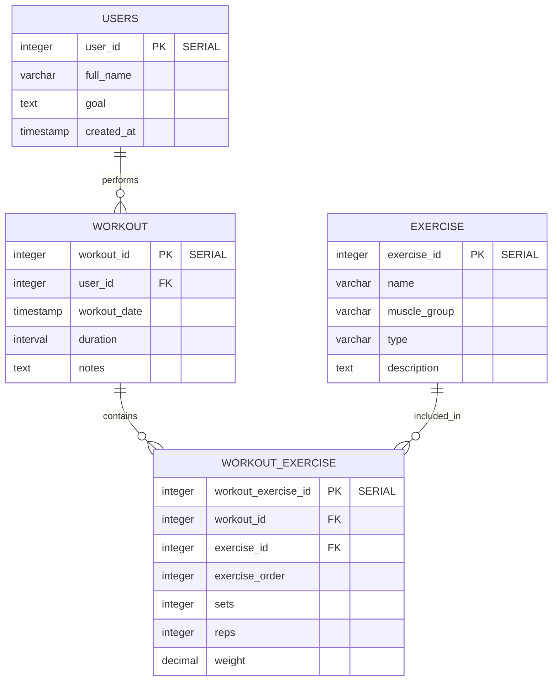
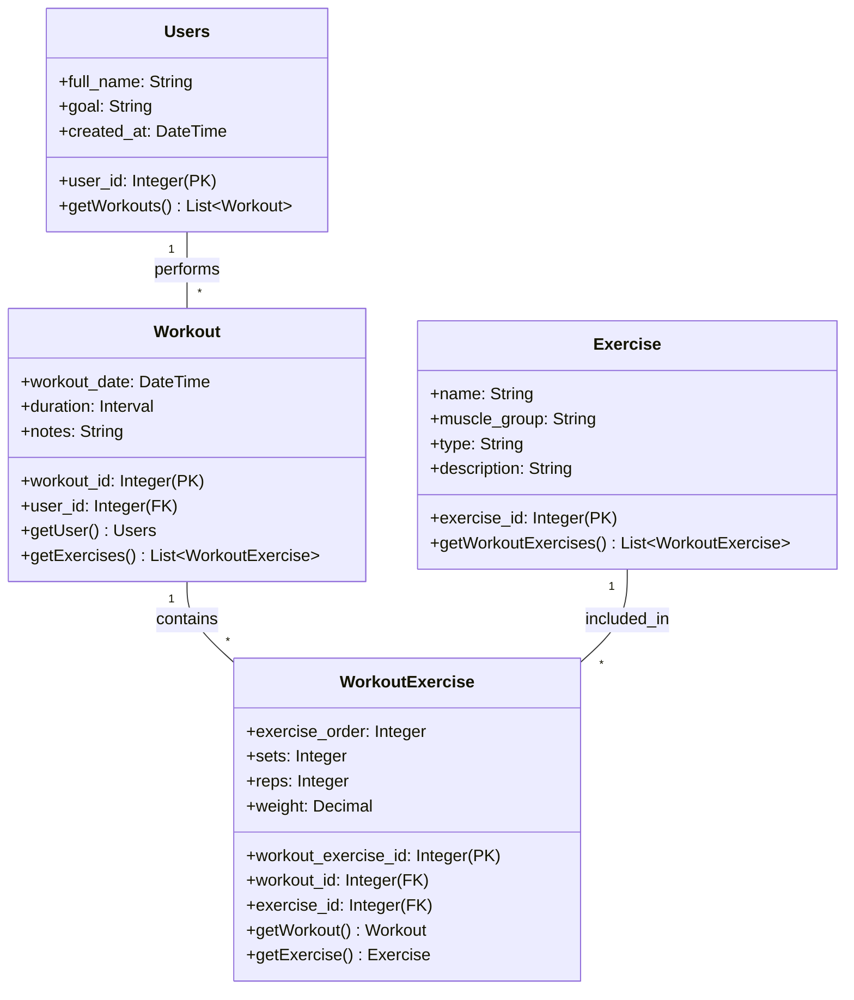
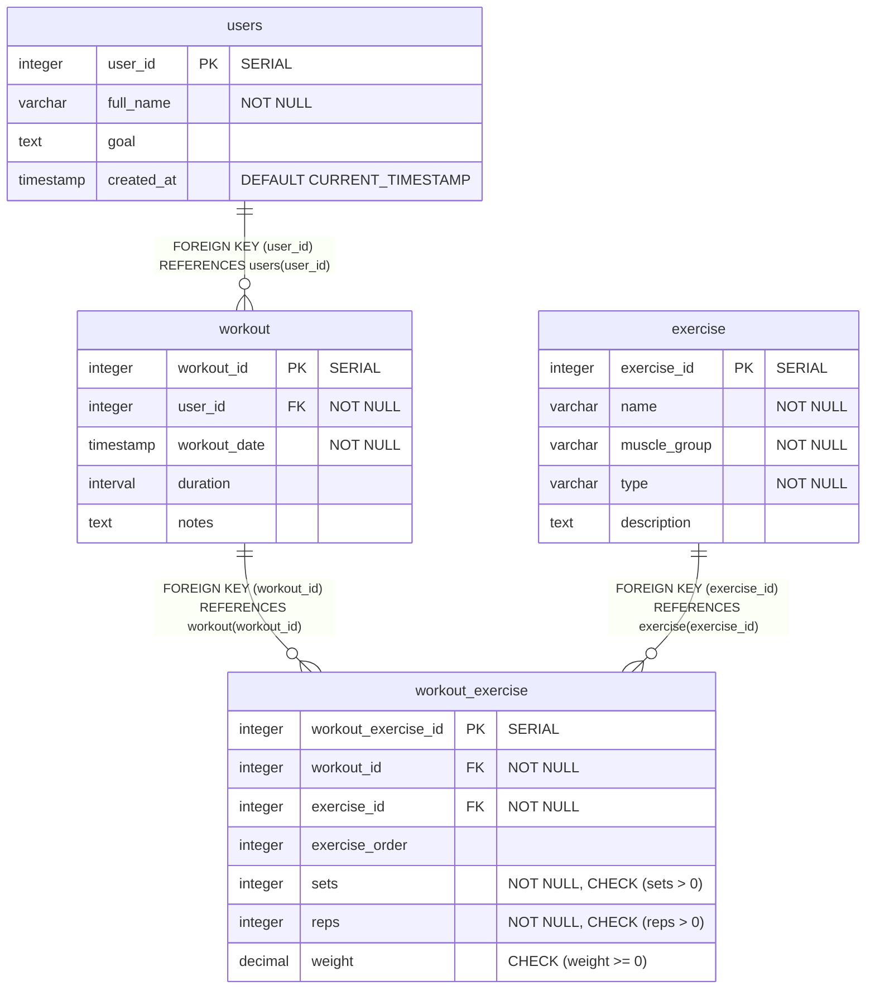

**Лабораторные работы по БД**

Перечень [лабораторных работ](https://edu.irnok.net/doku.php?id=db:main#%D0%BB%D0%B0%D0%B1%D0%BE%D1%80%D0%B0%D1%82%D0%BE%D1%80%D0%BD%D0%B0%D1%8F_%D1%80%D0%B0%D0%B1%D0%BE%D1%82%D0%B0_5_%D1%82%D1%80%D0%B8%D0%B3%D0%B3%D0%B5%D1%80%D1%8B)

Telegram: [at]dalannu

# Постановка задачи (вариант 38)

**Фитнес-трекер и планировщик тренировок**

*Сущности:* Упражнения (наименование, группа мышц, тип), тренировки (дата, продолжительность), пользователи (ID, ФИО, цель).

*Процессы:* Пользователи выполняют тренировки, состоящие из нескольких упражнений с определенным количеством подходов и повторений.

*Выходные документы:*

  - Для заданного пользователя выдать прогресс по рабочему весу в определенном упражнении за последний месяц, отсортированный по дате.
  - Выдать статистику по наиболее часто прорабатываемым группам мышц за указанный период, отсортированную по убыванию частоты.

# Лабораторная работа 1 (Проектирование логической и физической модели БД)


## Промпт к Дипсик

```text
Лаба по проектированию информационной модели для реляционных баз данных.
Предполагаем Postgresql.
Есть ошибки, замечания, неточности?

# Фитнес-трекер и планировщик тренировок

## Постановка задачи

*Сущности:*
    Упражнения (наименование, группа_мышц, тип),
    Тренировки (дата, продолжительность), 
    Пользователи (ID, ФИО, цель).

*Процессы:* 
    Пользователи выполняют тренировки, состоящие из нескольких упражнений с определенным количеством подходов и повторений.

*Выходные документы:*

  - Для заданного пользователя выдать прогресс по рабочему весу в определенном упражнении за последний месяц, отсортированный по дате.

  - Выдать статистику по наиболее часто прорабатываемым группам мышц за указанный период, отсортированную по убыванию частоты.

## ER-Модель
### Базовые сущности

    Пользователь(ФИО, цель), ключ - ID
    Упражнение(наименование, группа_мышц, тип), ключ - ID  
    Тренировка(дата, продолжительность), ключ - ID

### Отношения

    [Пользователь]-1,Required------------------N,Optional-[Тренировка]

    [Тренировка]-N,Required-----Выполнение------M,Required-[Упражнение]
                              подходы, повторения, вес

## Логическая модель

Используя правила преобразования ER-диаграмм получаем четыре *таблицы*:

  - ```User(user_id, full_name, goal)```, primary key - user_id
  - ```Exercise(exercise_id, name, muscle_group, type)```, primary key - exercise_id
  - ```Workout(workout_id, user_id, date, duration)```, primary key - workout_id
  - ```WorkoutExercise(workout_id, exercise_id, sets, reps, weight)```, composite primary key - (workout_id, exercise_id)

## Физическая модель

Зададим типы данных для атрибутов:

  - ```user_id::SERIAL```
  - ```full_name::varchar(100)```
  - ```goal::text```
  - ```exercise_id::SERIAL```
  - ```name::varchar(100)```
  - ```muscle_group::varchar(50)```
  - ```type::varchar(50)```
  - ```workout_id::SERIAL```
  - ```date::date```
  - ```duration::integer``` (в минутах)
  - ```sets::integer```
  - ```reps::integer```
  - ```weight::decimal(5,2)``` (вес в кг)

## Проверка нормальных форм

### Первая нормальная форма
Все значения всех атрибутов атомарные.

### Вторая нормальная форма
Выполняется: нет зависимостей неключевых атрибутов от части ключа

### Третья нормальная форма
Нет транзитивных зависимостей неключей от неключей

### Нормальная форма Бойса-Кодда
Соблюдена.
```

Отличная работа! Модель хорошо продумана и логична, но есть несколько важных замечаний и улучшений, которые стоит внести для создания более качественной базы данных.

### Критические замечания и рекомендации

#### 1. Первичный ключ для `WorkoutExercise`
**Проблема:** Использование составного первичного ключа `(workout_id, exercise_id)` может быть ограничивающим.
*   **Ограничения:** Не позволяет добавить одно и то же упражнение несколько раз в одну тренировку (например, с разными подходами/весами).
*   **Гибкость:** Суррогатный ключ дает больше гибкости для будущих изменений.

**Исправление:**
```sql
-- Было: WorkoutExercise(workout_id, exercise_id, sets, reps, weight)
-- Стало:
WorkoutExercise(
    workout_exercise_id SERIAL PRIMARY KEY,
    workout_id INTEGER NOT NULL REFERENCES Workout(workout_id),
    exercise_id INTEGER NOT NULL REFERENCES Exercise(exercise_id),
    sets INTEGER NOT NULL,
    reps INTEGER NOT NULL,
    weight DECIMAL(5,2)
);
```

#### 2. Добавление ограничений целостности
**Проблема:** Отсутствуют проверки на корректность данных.
*   **Отрицательные значения:** Количество подходов, повторений и вес не могут быть отрицательными.
*   **Обязательные поля:** Некоторые поля должны быть обязательными для заполнения.

**Исправление:**
```sql
-- Добавляем CHECK constraints
CREATE TABLE WorkoutExercise (
    workout_exercise_id SERIAL PRIMARY KEY,
    workout_id INTEGER NOT NULL REFERENCES Workout(workout_id) ON DELETE CASCADE,
    exercise_id INTEGER NOT NULL REFERENCES Exercise(exercise_id),
    sets INTEGER NOT NULL CHECK (sets > 0),
    reps INTEGER NOT NULL CHECK (reps > 0),
    weight DECIMAL(5,2) CHECK (weight >= 0),
    UNIQUE(workout_id, exercise_id) -- Обеспечиваем уникальность комбинации
);
```

#### 3. Улучшение структуры данных
**Проблема:** Некоторые типы данных можно улучшить для большей гибкости.
*   **Продолжительность:** Хранить продолжительность в минутах - хорошо, но можно добавить возможность хранить в интервале.
*   **Дата и время:** Для тренировок важно и время, а не только дата.

**Исправление:**
```sql
-- Улучшенная таблица Workout
CREATE TABLE Workout (
    workout_id SERIAL PRIMARY KEY,
    user_id INTEGER NOT NULL REFERENCES Users(user_id) ON DELETE CASCADE,
    workout_date TIMESTAMP NOT NULL DEFAULT CURRENT_TIMESTAMP,
    duration INTERVAL, -- Более гибкий тип для продолжительности
    notes TEXT -- Дополнительные заметки о тренировке
);
```

---

### Исправленная и улучшенная модель

#### Логическая модель
*   **`Users`** (`user_id`, full_name, goal)
*   **`Exercise`** (`exercise_id`, name, muscle_group, type)
*   **`Workout`** (`workout_id`, `user_id`, workout_date, duration, notes)
*   **`WorkoutExercise`** (`workout_exercise_id`, `workout_id`, `exercise_id`, sets, reps, weight)

#### Физическая модель (DDL для PostgreSQL)
```sql
CREATE TABLE Users (
    user_id SERIAL PRIMARY KEY,
    full_name VARCHAR(100) NOT NULL,
    goal TEXT,
    created_at TIMESTAMP DEFAULT CURRENT_TIMESTAMP
);

CREATE TABLE Exercise (
    exercise_id SERIAL PRIMARY KEY,
    name VARCHAR(100) NOT NULL,
    muscle_group VARCHAR(50) NOT NULL,
    type VARCHAR(50) NOT NULL,
    description TEXT
);

CREATE TABLE Workout (
    workout_id SERIAL PRIMARY KEY,
    user_id INTEGER NOT NULL REFERENCES Users(user_id) ON DELETE CASCADE,
    workout_date TIMESTAMP NOT NULL DEFAULT CURRENT_TIMESTAMP,
    duration INTERVAL,
    notes TEXT
);

CREATE TABLE WorkoutExercise (
    workout_exercise_id SERIAL PRIMARY KEY,
    workout_id INTEGER NOT NULL REFERENCES Workout(workout_id) ON DELETE CASCADE,
    exercise_id INTEGER NOT NULL REFERENCES Exercise(exercise_id),
    sets INTEGER NOT NULL CHECK (sets > 0),
    reps INTEGER NOT NULL CHECK (reps > 0),
    weight DECIMAL(5,2) CHECK (weight >= 0),
    UNIQUE(workout_id, exercise_id)
);

-- Индексы для ускорения часто используемых запросов
CREATE INDEX idx_workout_user_date ON Workout(user_id, workout_date);
CREATE INDEX idx_workout_exercise_workout ON WorkoutExercise(workout_id);
CREATE INDEX idx_workout_exercise_exercise ON WorkoutExercise(exercise_id);
CREATE INDEX idx_exercise_muscle_group ON Exercise(muscle_group);
```

#### Проверка нормальных форм (для исправленной модели)
*   **1NF:** Соблюдена.
*   **2NF:** Соблюдена, так как все неключевые атрибуты полностью зависят от целого первичного ключа.
*   **3NF/BCNF:** Соблюдена. Нет транзитивных зависимостей.

---

### Примеры запросов для "Выходных документов"

**1. Прогресс по рабочему весу для заданного пользователя и упражнения за последний месяц:**
```sql
SELECT 
    w.workout_date,
    we.weight,
    we.sets,
    we.reps
FROM WorkoutExercise we
JOIN Workout w ON we.workout_id = w.workout_id
JOIN Exercise e ON we.exercise_id = e.exercise_id
WHERE w.user_id = 1  -- ID заданного пользователя
    AND e.exercise_id = 5  -- ID заданного упражнения
    AND w.workout_date >= CURRENT_DATE - INTERVAL '1 month'
ORDER BY w.workout_date;
```

**2. Статистика по наиболее часто прорабатываемым группам мышц за указанный период:**
```sql
SELECT 
    e.muscle_group,
    COUNT(*) as workout_count,
    COUNT(DISTINCT w.workout_id) as unique_workouts
FROM WorkoutExercise we
JOIN Workout w ON we.workout_id = w.workout_id
JOIN Exercise e ON we.exercise_id = e.exercise_id
WHERE w.workout_date BETWEEN '2024-01-01' AND '2024-01-31'  -- Заданный период
GROUP BY e.muscle_group
ORDER BY workout_count DESC;
```

**Итог:** После внесения этих правок ваша модель станет более гибкой, надежной и соответствующей стандартам реляционного проектирования. Удачи в сдаче лабы!

## Промпт 2

```text
В таблице WorkoutExercise добавлен суррогатный ключ, но при этом сохраняется уникальность комбинации (workout_id, exercise_id).
Не приведет ли это к избыточности? Может ли одна тренировка содержать одно и то же упражнение несколько раз с разными параметрами?
```

**Отличный вопрос! Вы правы, это важный нюанс проектирования.**

### Анализ требования

Давайте рассмотрим два сценария:

#### Сценарий 1: Одно упражнение один раз за тренировку
- **Текущий подход:** `UNIQUE(workout_id, exercise_id)` предотвращает дублирование
- **Плюсы:** Простая структура, гарантия уникальности
- **Минусы:** Нельзя добавить суперсеты или повторы одного упражнения

#### Сценарий 2: Одно упражнение несколько раз за тренировку
- **Пример:** Жим лежа 3 подхода, потом после других упражнений еще 2 подхода
- **Требуется:** Убрать `UNIQUE` ограничение, добавить `exercise_order` или `set_number`

### Рекомендация

Для **фитнес-трекера** более гибким будет **Сценарий 2**, так как:
1. **Суперсеты** - распространенная практика
2. **Разделение на части** - иногда упражнение выполняется в начале и конце тренировки
3. **Гибкость** - не ограничивает пользователя

### Улучшенная модель:

```sql
CREATE TABLE WorkoutExercise (
    workout_exercise_id SERIAL PRIMARY KEY,
    workout_id INTEGER NOT NULL REFERENCES Workout(workout_id) ON DELETE CASCADE,
    exercise_id INTEGER NOT NULL REFERENCES Exercise(exercise_id),
    exercise_order INTEGER, -- Порядок выполнения в тренировке
    sets INTEGER NOT NULL CHECK (sets > 0),
    reps INTEGER NOT NULL CHECK (reps > 0),
    weight DECIMAL(5,2) CHECK (weight >= 0)
    -- Убрано UNIQUE(workout_id, exercise_id)
);

-- Добавляем индекс для порядка выполнения
CREATE INDEX idx_workout_exercise_order ON WorkoutExercise(workout_id, exercise_order);
```

### Когда сохранить уникальность?

Только если бизнес-требования явно запрещают повторение упражнений в одной тренировке.

**Вывод:** Для фитнес-трекера лучше убрать ограничение уникальности и добавить поле для порядка выполнения. Это дает больше гибкости пользователям.

## Полученные диаграммы:
### ER-диаграмма



## Логическая модель в виде Диаграммы классов UML-2.4



## Физическая модель БД



## Заключение

В первой лабораторной работе при помощи теоретического инструментария проектирования БД и большой языковой модели "Дипсик" произведено проектирование ER-, логической и физической модели базы данных варианта 38. Основные замечания, решенные в ходе выполнения лабораторной работы:

  1. Реализовано две итерации консультации с БЯМ;
  2. БЯМ исправила существенные ошибки проектирования (суррогатные ключи, ограничения целостности);
  3. Добавлены CHECK-ограничения для валидации данных;
  4. Улучшена гибкость модели (возможность повторения упражнений в одной тренировке);
  5. Оптимизированы типы данных (INTERVAL для продолжительности, TIMESTAMP для даты тренировки).

Ссылка на чат: https://chat.deepseek.com/a/chat/s/c8158baf-f8cf-43d5-8a2b-9d2b41cd6178


### Лабораторная работа 2.

## 1. Логическая модель данных
# Сущности и связи:
users — пользователи
exercises — упражнения
workouts — тренировки
workout_exercises — связующая таблица (упражнения в тренировке с подходами, повторениями, весом)

users (id, name, goal)
workouts (id, user_id, date, duration_minutes)
exercises (id, name, muscle_group, type)
workout_exercises (id, workout_id, exercise_id, sets, reps, weight_kg)

## 2. Coздание таблиц
# users:


# exercises:


# workouts


# workout_exercises:


## 3. Наполнение таблиц
# users:


# exercises:


# workouts


# workout_exercises:


## 4. Содержательные SELECT-запросы с JOIN
# Запрос 1: Для заданного пользователя выдать прогресс по рабочему весу в определенном упражнении за последний месяц, отсортированный по дате.


# Запрос 2: Выдать статистику по наиболее часто прорабатываемым группам мышц за указанный период, отсортированную по убыванию частоты


## 5. Проверка нормальных форм
# 5.1 Проверка соответствия 4НФ (Fourth Normal Form)
Таблица workout_exercises не содержит многозначных зависимостей. Все атрибуты функционально зависят от составного ключа (workout_id, exercise_id).

# 5.2 Проверка соответствия 5НФ (Fifth Normal Form)
Все связи декомпозированы без потерь информации:
Отношение M:M между workouts и exercises вынесено в отдельную таблицу workout_exercises
Нет избыточных соединений при восстановлении исходных данных

✅ Вывод: База данных соответствует 4-й и 5-й нормальным формам.
```
